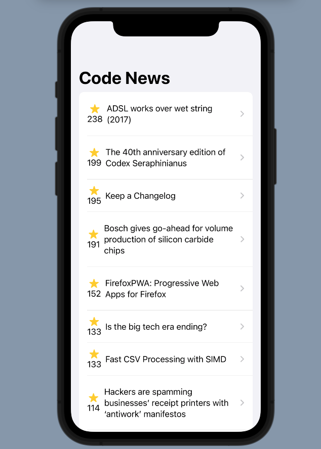
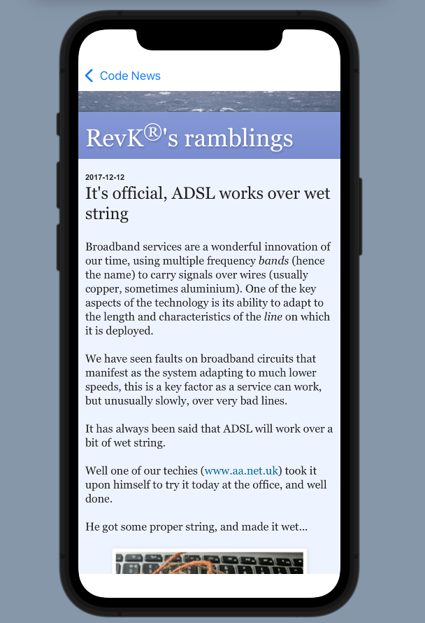
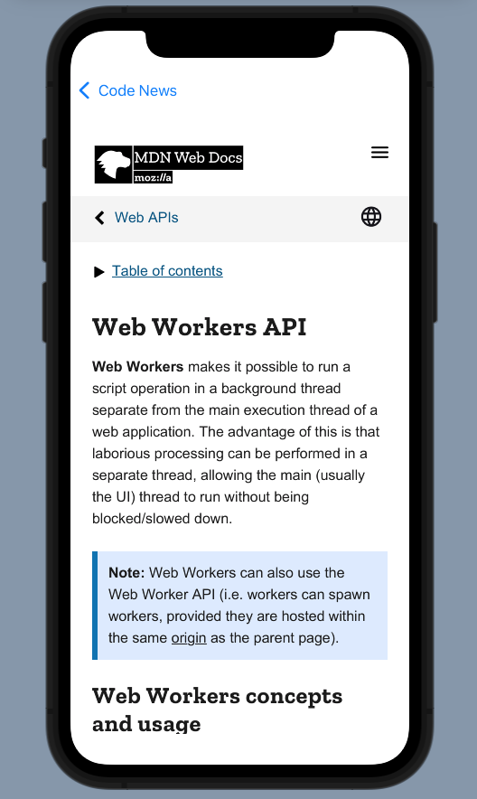

# CodeNews-SwiftUI

A simple news reader app build using SwiftUI.

## What I Learned
* Learned to work with SwiftUI Lists and the Identifiable Protocol
* Used Navigation View to navigate between List and Detail View
* Advance State Management using Observer Design Pattern
* Learned to incorporate a UIKit component into SwiftUI by using WebKit to display web pages in the app.

